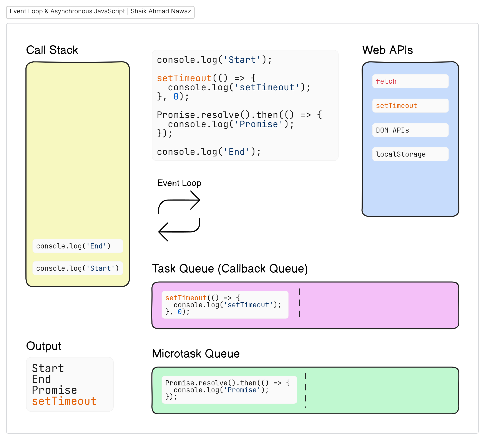

# Understanding How JavaScript Works Behind the Scenes

JavaScript is a powerful programming language that operates in a unique way, especially when it comes to handling multiple operations like timers and API calls. In this post, we'll explore the core components that make this possible, including the Call Stack, Web APIs, Task Queue, Microtask Queue, and the Event Loop.

### Key Components:

- **Call Stack**: JavaScript runs code line-by-line. All synchronous code goes into the call stack and is executed in order. Once a function finishes executing, it pops off the stack.

- **Web APIs**: Provided by the browser, these allow JavaScript to handle asynchronous operations, such as timers (`setTimeout`) and network requests (`fetch`). When these operations complete, their callbacks are placed in the Task Queue or Microtask Queue.

- **Task Queue (Callback Queue)**: When asynchronous work is complete (like a `setTimeout`), the callback moves into the task queue, where it waits to be processed.

- **Microtask Queue**: Higher-priority tasks, such as those from promises, are placed here and executed before any tasks in the task queue.

- **Event Loop**: This is the manager! It constantly checks if the call stack is empty. If it is, it pushes tasks from the microtask queue or task queue into the call stack for execution.

### Execution Flow Example:

1. **Synchronous Code**: The `"console.log('Start')"` is added to the call stack and logs "Start" to the console.
2. **`setTimeout`**: Registers its callback with the Web API and continues execution without waiting. No output yet.
3. **Promise**: Resolves, adding its `.then()` callback to the microtask queue. Still no output.
4. **End**: The `"console.log('End')"` is added to the call stack and logs "End" to the console. The call stack is now empty.
5. **Event Loop Check**: Processes the microtask queue first, executing the promise callback and logging "Promise".
6. **Task Queue Check**: Executes the `"setTimeout"` callback, logging "setTimeout".

I hope this breakdown helps you understand how JavaScript manages asynchronous operations through the event loop and related concepts. If you have any questions or want to share your thoughts, feel free to comment below! Happy coding!
