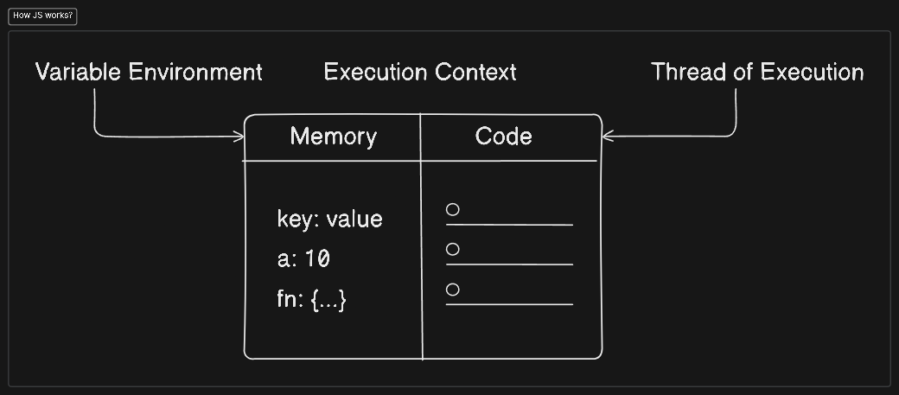

# JavaScript Working

Everything in JavaScript happens inside an execution context. This is a container that holds all the code that is running. There are two types of execution contexts: global and functional.

Memory is allocated in the execution context for variables and functions. When a function is called, a new execution context is created and pushed onto the execution stack. When the function finishes, the execution context is popped off the stack. as known as the variable environment.

Code component that is running is called the thread of execution. The thread of execution is the order in which the code is executed. as known as the thread of execution.

The JavaScript engine is a program that executes JavaScript code. It consists of two parts: the memory heap and the call stack.

The memory heap is where memory allocation happens. This is where objects are stored.

The call stack is where the execution context is stored. This is where the thread of execution is stored.

The JavaScript engine is single-threaded. This means that it can only execute one piece of code at a time.

JavaScript is a synchronous and single-threaded language. This means that it executes code in order and can only execute one piece of code at a time.

It means it can only go to the next line of code after the current line has finished executing.
